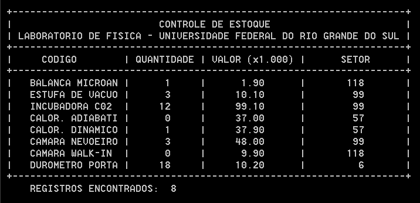

# Disciplina: INF01101 Computação Básica Fortran

> **Warning**
> 
> [DEPRECATED]  
> A tecnologia em uso neste repositório encontra-se obsoleta em muitos aspectos, e foram desenvolvidos no âmbito acadêmico. Os arquivos estão mantidos neste repositório apenas para fins de demonstração e documentação. 
<br />

## :bookmark_tabs: Súmula da Disciplina
**Súmula:**
* Conceitos básicos de computação,
* Linguagem FORTRAN: operadores, expressões, comandos, subprogramas.  
<br />

## :floppy_disk: Atividade Final

* :floppy_disk: **[Atividade Final](src/ativfim.f90)**: Criar um programa que abra o arquivo ativfim.dat (o arquivo será fornecido pelo professor) e mostre os dados na tela com a seguinte formatacao sugerida:
```
 +-------------------------------------------------------------------+
 |                         CONTROLE DE ESTOQUE                       |
 | LABORATORIO DE FISICA - UNIVERSIDADE FEDERAL DO RIO GRANDE DO SUL |
 +-------------------------------------------------------------------+ 
 |     CODIGO        | QUANTIDADE | VALOR (x1.000) |      SETOR      |
 +-------------------------------------------------------------------+
 | M47BCL1008122A1   |     31     |      1.90      |       118       |
 | JKT12544SHT1009   |    114     |     10.10      |        57       |
 +-------------------------------------------------------------------+ 
```  
<br />

### :computer: Capturas de Tela da Atividade Final

<br />
<br />

## :floppy_disk: Atividades de Exercícios
Atividades desenvolvidas no âmbito da disciplina **INF01101 Computação Básica Fortran** do curso de Licenciatura em Física, realizado na UFGRS - Universidade Federal do Rio Grande do Sul.

* :floppy_disk: **[Atividade 01](src/ativ01.f90)**: Programa que escreva uma mensagem na tela.<br />
* :floppy_disk: **[Atividade 02](src/ativ02.f90)**: Programa que recebe um número do teclado e escreva na tela.<br />
* :floppy_disk: **[Atividade 03](src/ativ03.f90)**: Programa que grava informações formatadas no arquivo ativ03.dat. Se o arquivo não existe, o programa deve criá-lo; se existe, então os dados previamente contidos nele deverão ser substituídos por novos valores.<br />
* :floppy_disk: **[Atividade 04](src/ativ04.f90)**: Programa que colet< os seguintes dados dos alunos: Nome, Nota 1, Nota 2 e Nota 3. Em seguida, escreva na tela o nome do aluno e a média das suas notas (as notas têm peso iguais). É obrigatória a utilização de type para definir os dados dos alunos.<br />
* :floppy_disk: **[Atividade 05](src/ativ05.f90)**: Programa que abre o arquivo ativ05.dat (o arquivo será fornecido pelo professor) e mostra os dados na tela com a seguinte formatacao sugerida:  
```  
                         Altura
   Nome         Idade   (metros)  Telefone                         
   ----         -----    ------   --------
P. A. Cabral      31      1.60    96556789
C. Colombo        42      1.65    21025499
```
<br />
<br />
